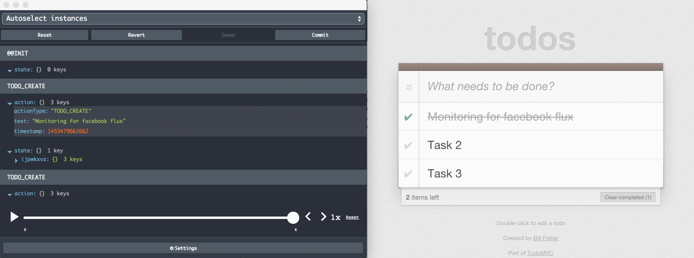

Reduce Devtools Extension
=========

Monitoring flux app's actions along with states to a remote monitor. Meant to be used even in production with any reducer pattern.



### Installation

##### NPM
```
npm install --save-dev reduce-devtools-extension
```

### Usage

```js
import { wrapWithDevtools, initDevtools } from 'reduce-devtools-extension';

// Wrap your root reducer
const rootReducer = wrapWithDevtools((state, action) => {
  switch (action.type) {
    // as usual
  }
});

// Init the devtools with your initial state and dispatch function
initDevtools(initialState, dispatch, options);

```

See [the examples folder for usage with React and VanillaJS](https://github.com/pacobabs/reduce-devtools-extension/tree/master/examples).

See [this page for a list of options](https://extension.remotedev.io/docs/API/Arguments.html). Not all of them are implemented. Feel free to open an issue if you need some to be implemented.

Any contribution is welcomed.

### Motivation

There is a misconception that the Redux devtools can only be used with Redux.
This package becomes useful for those who want to use the same reducer pattern with all the benefits
of Redux devtools.

### License

MIT